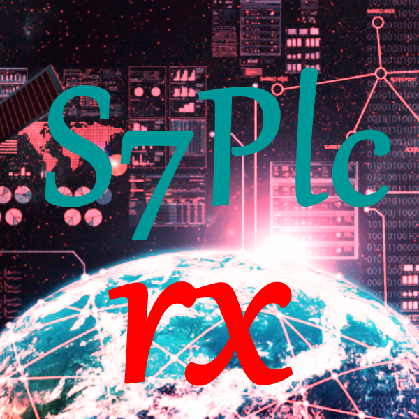

 [](https://github.com/ChrisPulman/S7PlcRx/actions/workflows/BuildOnly.yml)  [](https://www.nuget.org/packages/S7PlcRx)


<p align="left">
  <a href="https://github.com/ChrisPulman/S7PlcRx">
    
  </a>
</p>

# S7PlcRx
Reactive S7 PLC Communications Library

## Introduction
S7PlcRx is a library that provides a simple interface to communicate with Siemens S7 PLCs.

## Features
- Read and Write to PLC
- Read from PLC with Reactive Subscription


## Getting Started
### Installation
S7PlcRx is available on [NuGet](https://www.nuget.org/packages/S7PlcRx/).

In the Siemens PLC program you need to enable PUT/GET communication in the PLC settings.
You will also need to set any DBs you want to access to be non-optimized.

#### Package Manager
```powershell
Install-Package S7PlcRx
```

#### .NET CLI
```powershell  
dotnet add package S7PlcRx
```

### Usage
#### Setup Tags and Observe values in PLC
```csharp
using S7PlcRx;

var plc = new RxS7(S7PlcRx.Enums.CpuType.S71500, "PLC_IP_ADDRESS", 0, 5);
// Add Tag without Polling
plc.AddUpdateTagItem<double>("Tag0", "DB500.DBD0").SetTagPollIng(false);
// Add Tag with Polling
plc.AddUpdateTagItem<double>("Tag1", "DB500.DBD8");

plc.IsConnected
    .Where(x => x)
    .Take(1)
    .Subscribe(async _ =>
    {
        Console.WriteLine("Connected");

        // Read Tag Value manually
        var tag0 = await plc.Value<double>("Tag0");
    });

// Subscribe to Tag Values
plc.Observe<double>("Tag0").Subscribe(x => Console.WriteLine($"Tag0: {x}"));
plc.Observe<double>("Tag1").Subscribe(x => Console.WriteLine($"Tag1: {x}"));
// Start Polling on previously disabled Tag
plc?.GetTag("Tag0")?.SetTagPollIng(true);
```

#### SetPolling

Polling is enabled by default when a Tag is added. You can disable and enable polling on a Tag at any time.
```csharp
// Create a new Tag and with no Polling
plc.AddUpdateTagItem<double>("Tag0", "DB500.DBD0").SetTagPollIng(false);

// Set Polling on Tag
plc?.GetTag("Tag0")?.SetTagPollIng(true);

// Stop Polling on Tag
plc?.GetTag("Tag0")?.SetTagPollIng(false);
```

#### Write to PLC
```csharp
plc.Value<double>("Tag0", 1.0);
```

#### Read PLC CPU Info
```csharp
// Get CPU Info from PLC Async
var cpuInfo = await plc.CpuInfo();

// Get CPU Info from PLC Reactive
plc.GetCpuInfo().Subscribe(info =>
    {
    });
```

This returns a `CpuInfo` string Array with the following values:
AS Name, Module Name, Copyright, Serial Number, Module Type Name, Order Code, Version.

#### Supported Data Types

- Bool - DB?.DBX?.?
- Byte - DB?.DBB?
- Byte[] - DB?.DBB? set length to number of bytes when creating array tags - example AddUpdateTagItem<byte[]>(PlcData, "DB100.DBB0", 64) - creates a tag with 64 bytes
- Int - DB?.DBW?
- Int[] - DB?.DBW?
- UInt - DB?.DBW?
- UInt[] - DB?.DBW?
- DInt - DB?.DBD?
- DInt[] - DB?.DBD?
- UDInt - DB?.DBD?
- UDInt[] - DB?.DBD?
- Real - DB?.DBD?
- Real[] - DB?.DBD?
- LReal - DB?.DBD?
- LReal[] - DB?.DBD?
- String - TODO - for the time being use a Byte Array
- Word - DB?.DBW?
- Word[] - DB?.DBW?
- DWord - DB?.DBD?
- DWord[] - DB?.DBD?

Further types will be added in the future.

#### Supported PLCs

- Logo-0BA8
- S7-200
- S7-300
- S7-400
- S7-1200
- S7-1500
